# [.netget](https://github.com/rhildred/netget)
## gets a url using .net core

This is a project for my 2nd term INFO1380 networking class. More about networking then about .net core. This class has had a 1 semester introduction to programming in .net. I am developing this on OSX/macos during reading week. OSX because I have OSX from when a friend and I started a software company in the Waterloo Ontario Accelerator Center. All of the cool software startups ran OSX!

To get running I:

1. Installed vscode [from here](https://code.visualstudio.com/download).
1. Installed .net core [from here](https://www.microsoft.com/net/download/macos).
1. Added the C# powered by OmniSharp extension in vscode.

In vscode I:

1. Opened a new folder.
1. Opened a terminal window and ran `dotnet new console`.
1. Opened the resulting Program.cs and pressed `Ctrl-F5`.
1. Clicked `yes` on the following dialog.

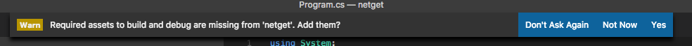

The next time I pressed `Ctrl-F5` I was treated to:

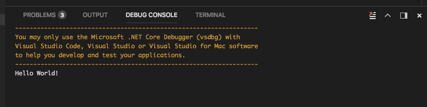

Then I replaced all of the code in Program.cs with this, my first networking code!!!!!:

```

using System;
using System.Net.Http;
using System.Threading.Tasks;

namespace helloC_
{
    class Program
    {
        private static readonly HttpClient client = new HttpClient();
        private static async Task ProcessRepositories(string sUrl)
        {
            var stringTask = client.GetStringAsync(sUrl);

            var msg = await stringTask;
            Console.Write(msg);
        }
        static void Main(string[] args)
        {
            if(args.Length > 0){
                ProcessRepositories(args[0]).Wait();
            }else{
                Console.WriteLine("usage .... " + System.AppDomain.CurrentDomain.FriendlyName + " <url>");
            }
        }
    }
}


```

Then when I pressed `Ctrl-F5` I was treated to this:

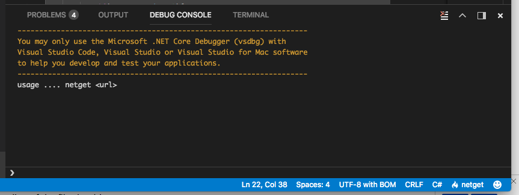

Almost there! To get `args[0]` populated I had to change the debug config in `.vscode/launch.json` to add to the `args[]`.


Finally when I pressed `Ctrl-F5` I was treated with:

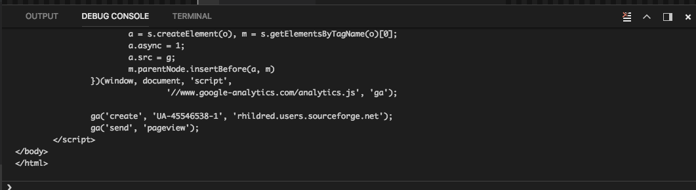

Whoa! What just happened here? Well it turned out that a lot had to go right for this to work. All of that is the true thrust of this networking course.

## Divide and conquer with layers

Have you seen a picture that looks like this before?

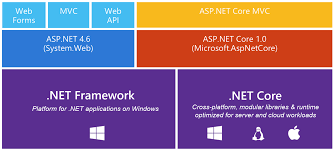

Because my application is written to the .net core layer it will run on Windows, Linux and OSX. The big breakthrough with .net core is that it opens C# programming to Linux in a new way. Linux is a network operating system (NOS) just like windows server. A network operating system runs services on behalf of many users. A network operating system usually has more memory and processing power than a client operating system like Android, IOS, Macos or Windows 10. Enterprises like Linux as a network operating system because it scales better than Windows in many ways. This matters to our (programming) people because with .net core enterprises can write C# code that scales as well as Java code.  

## Networking also uses a layered approach.


The line of code:

```

    var stringTask = client.GetStringAsync(sUrl);

```

sends this `GET / HTTP/1.0` request to the web server host `rhildred.github.io`. As you may have guessed from the domain name this host is part of a social network for programmers called github. You will be learning in a few weeks hot to put your own html code from last term on github. 

## Encapsulation

If you haven't learned this already encapsulation in object oriented programming is combining data and the methods and metadata that work on that data into one package. It is a good idea because consumers of the object don't need to know the internals of the object to use it. Encapsulation hides the object from the consumers of that object. The implementation can then change without the consumers being affected.

Encapsulation in networking is similar. As we go through the layers we add header code to the data from the layer above. The header code is used to do the right thing to send the data to the next layer below. The header code has addressing and state information in it for each layer.

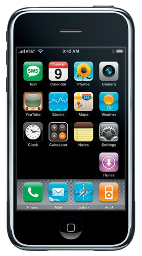

Part of the big leap forward with this device is that as well as SMS and digital calls it also used plain IP over the cellular network. The IP layer was then able to support a regular Safari like WebKit browsing experience and the smart phone really took off.

### Application Layer

Like that browser our application is using the http service in the application layer. In .net core the http service is provided by the HttpClient object which is created with:

```

private static readonly HttpClient client = new HttpClient();

```

We call a method on that object:

```

    var stringTask = client.GetStringAsync(sUrl);

    var msg = await stringTask;
    Console.Write(msg);


```

wait for and print the result. 

Under the covers the HttpClient uses another application service DNS to get the IP address of that rhildred.github.io server.

```

helmsdeep:netget rhildred$ nslookup rhildred.github.io
Server:         2607:fea8:1cdf:f4a0:aa4e:3fff:fed0:73c2
Address:        2607:fea8:1cdf:f4a0:aa4e:3fff:fed0:73c2#53

Non-authoritative answer:
rhildred.github.io      canonical name = sni.github.map.fastly.net.
Name:   sni.github.map.fastly.net
Address: 151.101.125.147


```

Then the WebClient opens a socket to `151.101.125.147:80`.

### Transport Layer


The word socket predates networking. We plug something in to a socket to complete a circuit. The transport layer creates a circuit between 2 applications. In this case our WebClient app and the web server at http://rhildred.github.io.

#### TCP

Under the covers the socket is created with TCP.

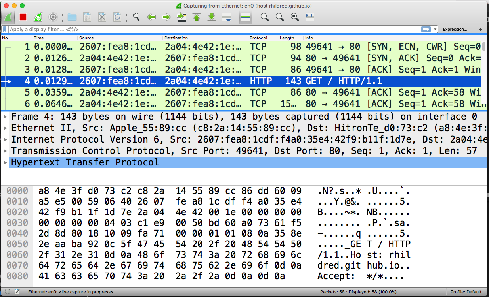

Before we see the `GET / HTTP/1.0` we see 3 packets. 

1. The first is the client sending a packet with the flag SYN set to the server. 
1. The 2nd is the server sending back a packet with the SYN and ACK flags set. At this point the socket is open on the server side.
1. The 3rd is the client sending a packet with the ACK flag set to say that the socket is open on the client side

There used to be an exploit called the SYN flood denial of service attack where rogue clients would send SYNs until all of the server's socket resources were used up. How do you think servers protect against this exploit?

#### Closing the socket

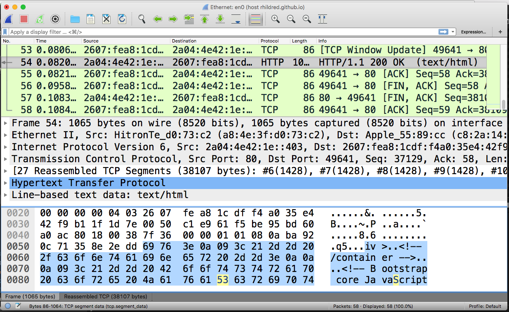

The server sends back a http response containing the html for my web page. The html is too big to fit in one packet so it needs to be reassembled by TCP from 27 segments. Then the machines both agree to close the socket.

#### UDP

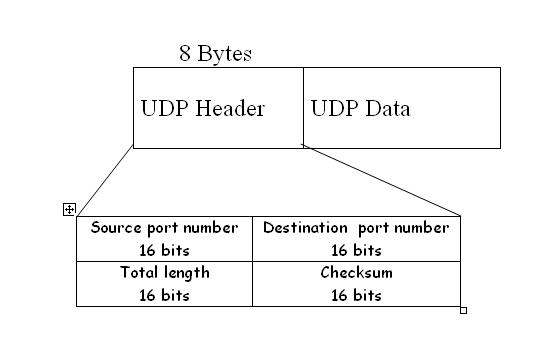

Say you have data that is less than 1 packet in size (~1024 bytes). Say that data is time sensitive and that you would rather not have the overhead of reliable delivery. UDP is a thin layer on top of IP datagrams to send time sensitive data like live voice or video or video game controller information.

UDP adds ports so that the datagram can be received by the correct application. It adds length and a checksum so that the receiving application can recalculate the checksum and make sure that the data isn't misshapen as Metcalfe said in the 40th anniversary of ethernet video. That's it.

We use TCP for reliable transmission like streaming from YouTube. We use UDP for speed in live situations.

### Network Layer

TCP/IP started as a military project with 3 goals:

* Survive a nuclear strike
* Permit different computer systems from different Nato allies to communicate easily
* Interconnect systems even into space

The network layer realizes these goals by routing packets individually, potentially around smoking holes. The French had little gourmet packets in their ATM networks while even packets are bigger in Texas. The network layer can fragment packets to work with different systems. Finally the network layer is responsible for addressing nodes for communication. With the new IPV6 network layer 128 bit addresses we can have 340 trillion, trillion trillion addresses. Even with IPV4 networks 32 bit addresses we can have 4.3 billion nodes. 

[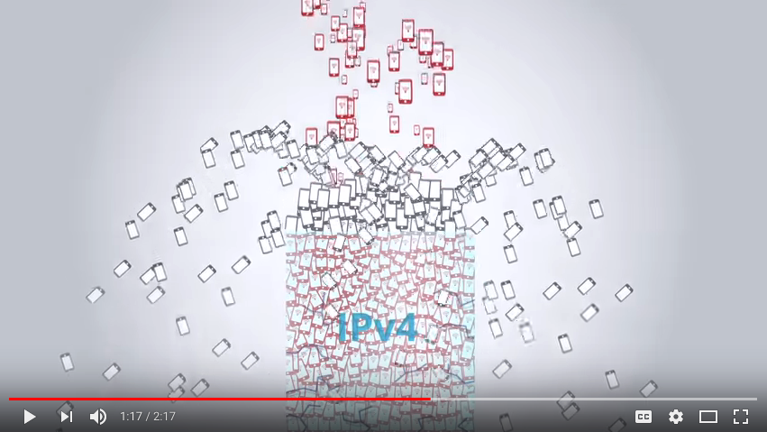](https://www.youtube.com/watch?v=-Uwjt32NvVA)

With name address translation (NAT) we have been able to make many more private IP addresses be behind many fewer public IP addresses so that our hit applications can run on the worlds 5.5 billion cellphones.

### Link Layer


The link layer is responsible for the physical transmission of the signal. Link layer mediums in common use are twisted pair cables, coaxial cables, fiber and the radio spectrum. Like our tin can telphone example where the medium is a taut string some media can only send one signal at a time. Senders and receivers must take turns. The link layer mediates turn taking in what we call a half duplex mode. Other media like twisted pair has one pair of wires for transmission and 1 pair for receiving. In this full duplex case the sender and receiver can work simultaneously. There is also a mode of using mostly radio spectrum called simplex. This is the case that we are used to from car radios and network television.

## OSI Model

TCP/IP was developed as a defence project in the 1960s to: 

* Survive a nuclear strike
* Permit different computer systems from different Nato allies to communicate easily
* Interconnect systems even into space


The OSI model was developed later as a theoretical model. One can think of the OSI model as adding 3 layers to TCP/IP. 

### Physical Layer

TCP/IPs Link layer was effectively split in 2 in the OSI model. The OSI model recognized that things like turn taking could be done in the same way in different physical media.

### Session Layer

The session layer was put in between the application and the transport layer. Session layer is important to programmers as a way to think about peer to peer communications as opposed to client server. In peer to peer communications like voice over ip or torrenting a machine on the internet is used to set up a socket between 2 other machines potentially behind a NAT. In Session Initialization Protocol (SIP) and WebRTC Session Traversal Utilities for NAT (STUN) are used on a machine on the internet to punch a hole into the NAT that a socket can be connected through.

### Presentation Layer

The presentation layer was important in the 80s when file servers and print servers were the killer applications for Networking. The presentation layer can be thought of as what makes our g: drives appear as a local drive on every computer that we log on to at school.

## How Do Computers Find Each Other on Networks

To be able to find another computer on a network a computer first needs an address of it own on the local area network segment that it is part of. If you have noticed this on your screen when you are connecting to wifi at Tim's:

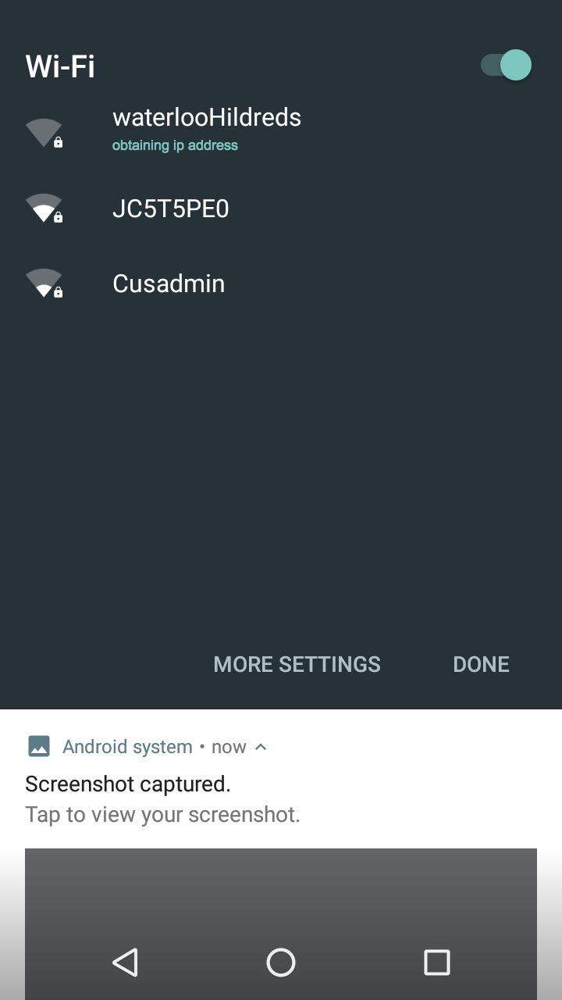 

you have been a witness to your computer getting an address from Dynamic Host Configuration Protocol (DHCP).

Before DHCP existed to get an ipaddress at Tim's you would need to type:

1. The IP address in from a coaster. 
2. You would also need to supply the ip address of a gateway to get out on the internet.
3. The netmask to identify whether a computer is on the same segment as us.
4. DNS servers for looking up ip addresses from hostnames like https://rhildred.github.io 

You did type all of this information for assignment 2.

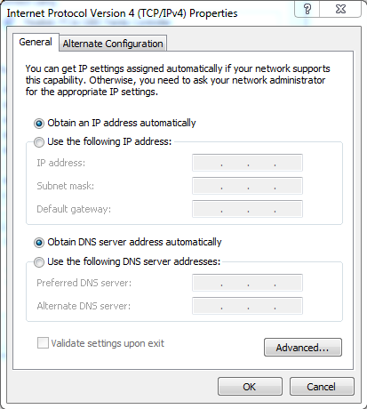

Clicking `Obtain IP Address Automatically` meant that we used DHCP. If that is off all of the information on this screen must be entered by hand. Too cumbersome and prone to error for a coffee shop.

## Your computer has 3 other names 

... in addition to it's IP Addresses. The names are used by the various layers to find the computer.


## hostname

The hostname is for the carbon units. I like to name my hosts according to Tolkien places. As I alluded to when I mentioned the application layer hostnames are managed on the internet by a distributed database. This database is called the Domain Name Service (DNS). Names on the internet are sold by companies like enom.com and GoDaddy. A short domain name that has an english word in it can be over $1000. People buy domain names and speculate that they will be worth more when someone has an idea that matches the name. A domain name like ysaas.ca has a node in the distributed database called a zone. This is the zone for ysaas.ca:

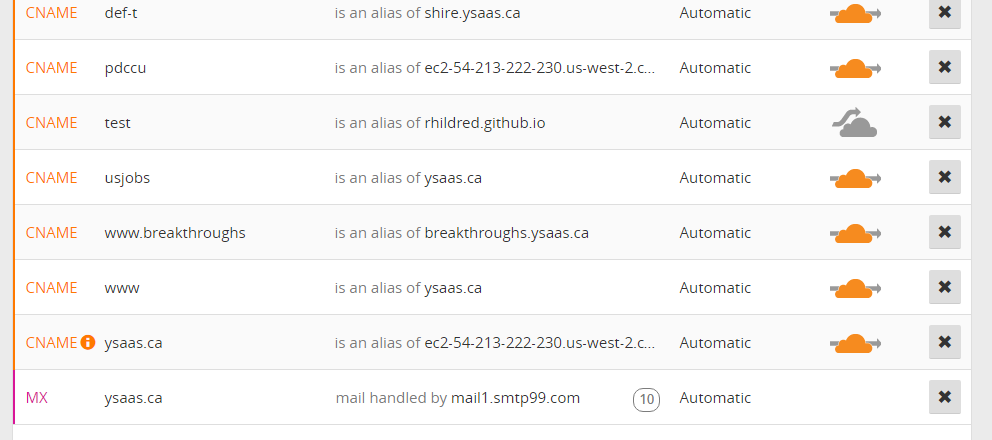

Each line in the zone is a record/row in the database. There are 3 different types of row in common use:

### Address

An A or AAAA record is an address record. It maps a name to an IPV4 or IPV6 address. We don't see any of those in the ysaas.ca zone for reasons we will discuss next

### Canonical Name

A cname record is an alias for another name. If I wanted to rename rhildred.github.io to be rhildredIsACoolGuy.com I could do that easily with a cname record. One of my colleagues still runs servers in his basement. Not me. I run my programs on the cloud. Resources on the cloud usually already have a name provided by the cloud vendor. Cnames allow you to show your control over these resources by putting them in your own domain.

### Mail Exchange

A Mail Exchange (mx) record identifies the host that processes email that is sent to @ysaas.ca email addresses in this case.

## Port

A computer can have multiple processes running on it. For instance:

```

[chrome.exe]
  TCP    172.31.22.14:56922     151.101.52.133:443     ESTABLISHED
 [chrome.exe]
  TCP    172.31.22.14:56923     151.101.52.133:443     ESTABLISHED
 [chrome.exe]
  TCP    172.31.22.14:56935     93.184.215.201:443     TIME_WAIT
  TCP    172.31.22.14:56940     216.58.193.78:80       TIME_WAIT
  TCP    172.31.22.14:56949     172.217.3.163:443      CLOSE_WAIT
 [chrome.exe]
  TCP    172.31.22.14:56976     13.107.6.175:443       ESTABLISHED
 [Code.exe]
  TCP    172.31.22.14:56981     40.83.182.206:443      ESTABLISHED
 [Code.exe]

``` 

The connections above belong to the process chrome.exe on the 172.31.22.14 side. Each connection has it's own port on the client side and a different ip:port on the partner server side. Notice how the server side ports are 80 and 443. We call these well known ports. 80 is http and 443 is https. The client side ports are called dynamic ports and are in the range 49152 through 65535. A NAT also works with port numbers to translate many private IP addresses to 1 public IP address to conserve public IP addresses. A NAT takes the private socket and adds it to a table. The index of the table gets written as the source port while the source IP is specified as the public IP address of the NAT. When the NAT router gets a reply it looks up the port in the table and sends the reply on the private network to the correct socket.

### IP/Logical/Network

An IP address uniquely identifies a host on the internet. It is a 32 bit quantity for IPV4 and a 128 bit quantity for IPV6. As I mentioned when discussing the network layer there are only ~4 billion 32 bit quantities and ~5.5 billion cellular devices. We would have run out of IP addresses except for name address translation (NAT) which maps up to ~4000 private ip addresses to a single public IPV4 address. 

[](https://www.youtube.com/watch?v=-Uwjt32NvVA)

With IPV6 128 bit addresses we can have 340 trillion trillion trillion devices, removing the need for name address translation.

For both IPV6 and IPV4 addresses the leftmost portion identifies the local area network/link and the rightmost portion identifies the device on that network. With IPV6 networks the first 64 bits are the link portion and the last 64 bits identify the device. For IPV4 the number of bits that identify the network/link are written at the end of the ip address preceded by a slash. This is called a Classless Inter Domain Routing (CIDR) block.

The IPV4 address of the computer that I am using to write this is `192.168.0.10/24`. The network is `192.168.0.0/24` The IPV6 address is `2607:fea8:1cdf:f4a0:4c:c12e:a079:a7aa`. The IPV6 network is `2607:fea8:1cdf:f4a0::`. For an IPV6 address we don't put in groups of 0s, substituting instead adjacent colons.

### MAC/Physical

Computers and routers/gateways on a lan need a local address. As a packet goes from LAN segment to LAN segment a local address is used on that segment. In our example the WebClient opens a socket from `192.168.0.10:57753/24` to `151.101.125.147:80`. When we get to the link layer the ip addresses differ in the first 24 bits so are not on the same network. The Link layer uses the Address Resolution Protocol (ARP) to look up the gateway ip address that it got from DHCP. 

```

helmsdeep:netget rhildred$ arp -a
hitronhub.home (192.168.0.1) at a8:4e:3f:d0:73:c2 on en0 ifscope [ethernet]
? (192.168.0.11) at 48:d6:d5:2a:de:e4 on en0 ifscope [ethernet]
? (192.168.0.254) at 0:55:7b:b5:7d:f7 on en0 ifscope [ethernet]
? (224.0.0.251) at 1:0:5e:0:0:fb on en0 ifscope permanent [ethernet]
? (239.255.255.250) at 1:0:5e:7f:ff:fa on en0 ifscope permanent [ethernet]
helmsdeep:netget rhildred$

```

The link layer sets the destination MAC/physical address as the address of the gateway in this case `a8:4e:3f:d0:73:c2`. When the gateway/router gets the packet it looks up the destination IP address `151.101.125.147` in it's routing table. If it has a gateway for that network it looks up the destination IP using ARP and supplies that physical address as the destination physical address. If it doesn't have a route to that address the router uses it's default gateway to send the packet onwards.

## Routing

A router has a foot in at least 2 local area networks and acts as a gateway between LANs. Consider our example.

```

C:\Users\rhildred\Documents\scratch\netget>tracert 151.101.125.147

Tracing route to 151.101.125.147 over a maximum of 30 hops

  1     *        *        *     Request timed out.
  2     *        *        *     Request timed out.
  3     *        *        *     Request timed out.
  4     *        *        *     Request timed out.
  5     *        *        *     Request timed out.
  6    <1 ms    <1 ms    <1 ms  100.65.9.97
  7     1 ms     1 ms     1 ms  52.93.15.222
  8    20 ms    44 ms     3 ms  52.93.12.100
  9     2 ms     1 ms     1 ms  52.93.12.77
 10     *        *        *     Request timed out.
 11     8 ms     8 ms     8 ms  54.239.43.133
 12     7 ms     7 ms     7 ms  54.239.42.216
 13    14 ms    10 ms    11 ms  52.95.52.192
 14    10 ms     8 ms     8 ms  52.95.52.181
 15     8 ms     8 ms     8 ms  ae-8.a01.sttlwa01.us.bb.gin.ntt.net [198.104.202.181]
 16    33 ms    33 ms    32 ms  be3048.ccr21.sea02.atlas.cogentco.com [154.54.11.9]
 17    41 ms    42 ms    41 ms  be2085.ccr21.slc01.atlas.cogentco.com [154.54.2.198]
 18    48 ms    48 ms    48 ms  be3037.ccr21.den01.atlas.cogentco.com [154.54.41.146]
 19    60 ms    60 ms    59 ms  be3035.ccr21.mci01.atlas.cogentco.com [154.54.5.90]
 20    71 ms    71 ms    71 ms  be2831.ccr41.ord01.atlas.cogentco.com [154.54.42.166]
 21    79 ms    78 ms    79 ms  be2717.ccr21.cle04.atlas.cogentco.com [154.54.6.222]
 22    85 ms    85 ms    85 ms  be2993.ccr31.yyz02.atlas.cogentco.com [154.54.31.226]
 23     *        *        *     Request timed out.
 24    86 ms    86 ms    86 ms  151.101.125.147

Trace complete.

``` 

We have reached our destination through 24 hops. Each hop is another gateway to another network segment. 

## Routing Tables

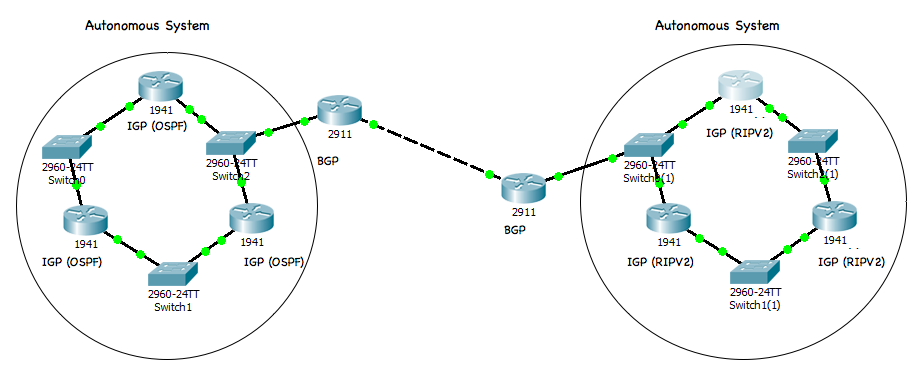

All routers have routing tables made of networks and the gateways to reach them. Different routers create those routing tables in different ways. There are 3 basic ways:

1. Link state like Open Shortest Path First (OSPF) which discovers neighbors by the state of links to them.  
2. Distance vector like Routing Information Protocol (RIPV2) which shares information about the number of hops and other metrics.
3. Path state used by a Border Gateway Protocol (BGP) router that is manually configured by a network administrator to make core routing decisions. Border gateway protocol is an exterior gateway protocol that links autonomous systems. 

OSPF (Open Shortest Path First) and Border Gateway Protocol(BGP) are two examples of routing protocols that support multiple types of services. OSPF can be used on an interior or border router and BGP can be used on a border or an exterior router. 

Convergence is the state of having a complete routing table with only 1 route to each network. Ideally routers converge quickly to a new routing table when a node stops routing.